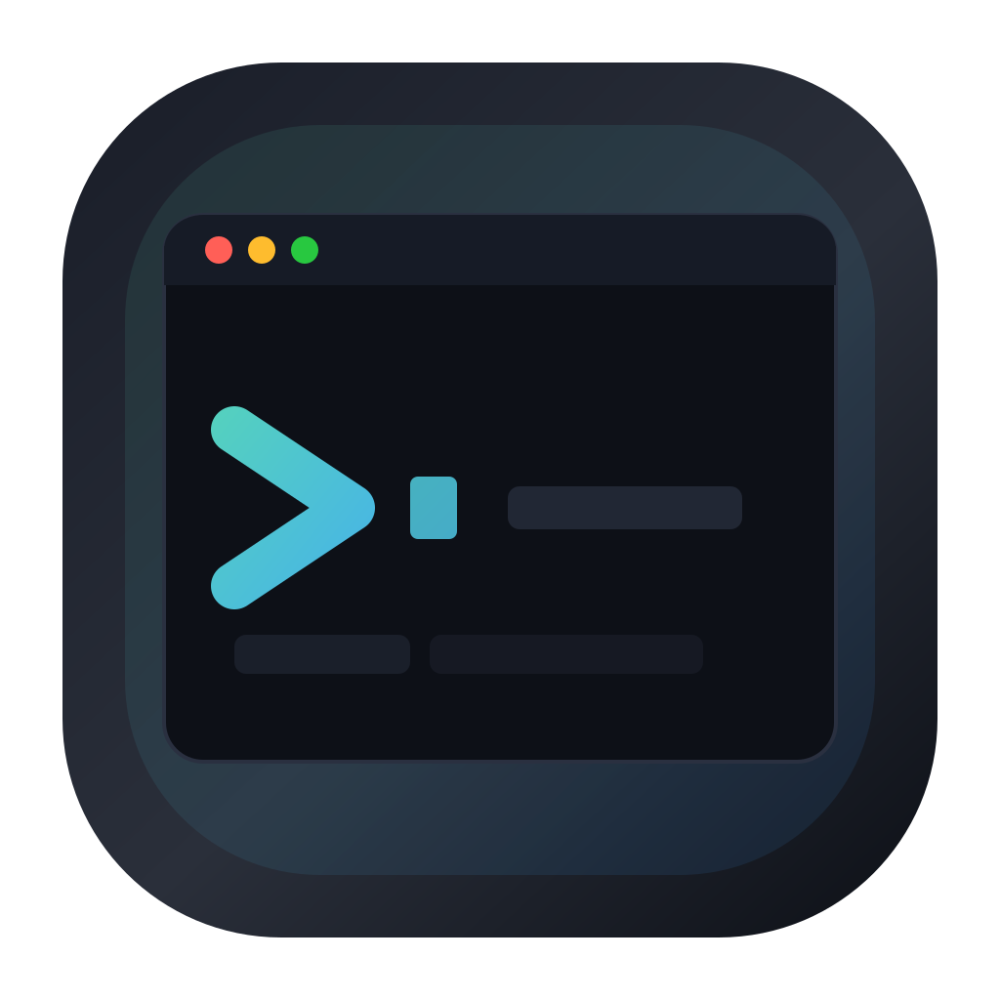
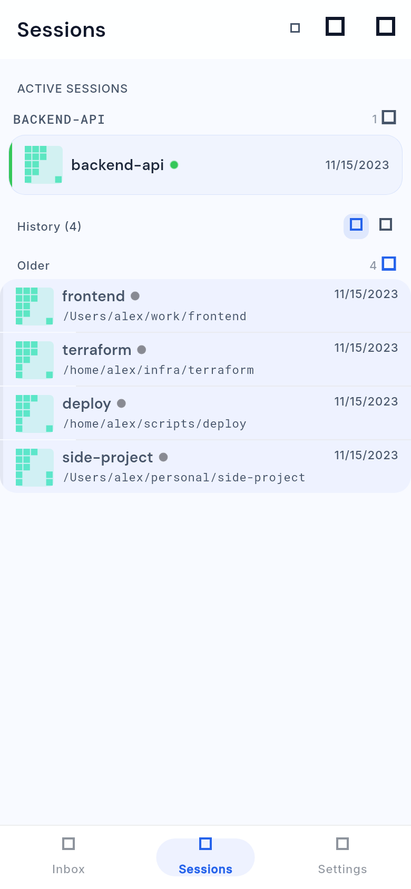
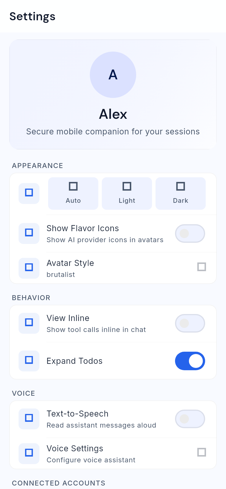

# Happy Flutter

A Flutter reimplementation of the Happy mobile app, achieving full feature parity with the original React Native implementation.

<p>
  
</p>

## Overview

Happy Flutter is a cross-platform mobile application built with Flutter that provides secure, end-to-end encrypted messaging, session management, and AI-assisted development workflows. This project maintains complete compatibility with the React Native implementation while leveraging Flutter's performance and native capabilities.

## Screenshots

<p>
  
  
  
</p>

## Architecture

The project follows **Feature-Based Clean Architecture** with clear separation of concerns:

```
lib/
├── main.dart                    # App entry, theme, AuthGate wiring
├── core/
│   ├── api/                     # ApiClient (Dio+NativeAdapter), SocketIoClient, per-domain API classes
│   ├── encryption/              # NaCl/libsodium (legacy) + AES-256-GCM (new), key derivation/caching
│   ├── i18n/                    # Localization helpers
│   ├── models/                  # Pure Dart models with manual fromJson/toJson/copyWith
│   ├── providers/               # Riverpod NotifierProviders (one file per notifier; app_providers.dart is the barrel)
│   ├── routing/                 # GoRouter setup (createRouter()) and ~64 route definitions
│   ├── rpc/                     # RPC layer
│   ├── services/                # Auth, Sync (split across ~20 _sync_*.dart part files), storage, push, TTS, etc.
│   ├── theme/                   # app_tokens.dart: AppSpacing, AppRadius, AppFontSize, AppDuration, AppBreakpoint
│   ├── ui/                      # Lower-level shared widgets (avatars, tab_bar, shimmer, diff, status_bar)
│   ├── components/              # Higher-level shared components (AppCard, AppEmptyState, sidebar, settings sections)
│   ├── widgets/                 # App-level widgets (ErrorBoundary, AuthGate, etc.)
│   └── utils/                   # InvalidateSync, SyncSubscriptionMixin, logging, helpers
└── features/
    ├── auth/                    # Landing, QR authentication, device linking, backup restore
    ├── changelog/               # In-app changelog viewer
    ├── chat/                    # Chat interface, input, markdown, tool views, autocomplete
    ├── command_palette/         # Modal command search
    ├── dev/                     # Dev logs, encryption debug, network inspector, notification test
    ├── inbox/                   # Friends, friend search, inbox
    ├── sessions/                # Session list (embeds Inbox + Settings as inline tabs), creation, pickers
    ├── settings/                # App settings (theme, language, voice, profiles, usage, machines, etc.)
    ├── artifacts/               # Artifact list, detail, edit, create
    ├── machine/                 # Machine detail
    ├── sftp/                    # SFTP feature with own models/providers/screens
    ├── terminal/                # Terminal connect and screen
    ├── user/                    # User profile
    └── zen/                     # Todo/zen mode
```

### Key Architectural Patterns

- **State Management**: Riverpod v3 with manual `NotifierProvider` (no code generation)
- **Sync Singleton**: Central in-memory data hub (`Sync` class) — main file ~1,000 lines, split across ~20 `_sync_*.dart` part files. `InvalidateSync` provides debounced server fetches with exponential backoff.
- **Provider Bridge**: Notifiers expose `loadFromSync()` (in-memory read) and `refreshFromSync()` (server fetch + read). Screens use `SyncSubscriptionMixin` (in `lib/core/utils/`) which wraps `sync.onDataChanged` / `onDomainChanged` with deduplication.
- **Service/API Duality**: Some domains expose both a singleton `XxxService` (production) and an injectable `XxxApi` class (tests).
- **Platform-Specific Code**: Conditional exports — `platform_io.dart`/`platform_stub.dart`, `mmkv_storage_native.dart`/`mmkv_storage_web.dart`, `sodium_loader_native.dart`/`sodium_loader_web.dart`, `sentry_*.dart`

## Technology Stack

- **Flutter**: 3.41.x via mise (Dart 3.11+)
- **State Management**: Riverpod v3
- **HTTP Client**: Dio with NativeAdapter (Cronet/cupertino_http)
- **WebSocket**: Socket.IO protocol implementation
- **Encryption**: libsodium via `sodium` package + AES-256-GCM via `cryptography` package
- **Storage**: MMKV (flutter_mmkv) for fast local storage
- **Navigation**: GoRouter
- **UI**: Material Design 3 with custom design tokens

## Setup Instructions

### Prerequisites

1. Install mise: <https://mise.jdx.dev/getting-started.html>
2. Install the pinned toolchain: `mise install`

### Development Environment

```bash
# Install the pinned Flutter / Dart / Java toolchain
mise install

# Get dependencies
mise exec -- flutter pub get

# Run code generation (for mocks)
mise exec -- flutter pub run build_runner build

# Run the app
mise exec -- flutter run

# Run tests
mise exec -- flutter test

# Analyze code
mise exec -- flutter analyze
```

### Build Flavors

- `development` — development server, debug logging enabled
- `preview` — staging server, reduced logging
- `production` — production server at `api.cluster-fluster.com`

```bash
# Build APK for development
mise exec -- flutter build apk --debug --flavor development

# Build APK for production
mise exec -- flutter build apk --release --flavor production

# Build for iOS
mise exec -- flutter build ios --release
```

## Project Structure

### Design Tokens

Spacing and radius tokens are defined in `lib/core/theme/app_tokens.dart`:

- **Spacing**: `AppSpacing.xs/sm/md/lg/xl/xxl/xxxl` (4/8/12/16/20/24/32 px)
- **Radius**: `AppRadius.xs/sm/md/lg/xl/pill` (4/8/12/16/20/100 px)

### Key Services

| Service | Pattern | Purpose |
|---------|---------|---------|
| `ApiClient` | Singleton | Dio + NativeAdapter. `validateStatus: (_) => true` — callers must check status manually |
| `SocketIoClient` | Singleton | Socket.IO on path `/v1/updates`, transport `['websocket']` only |
| `AuthService` | Singleton | QR authentication, Ed25519 signatures |
| `Sync` | Singleton | Central in-memory data hub with all server state |
| `Storage` | Singleton | MMKV wrapper for user data (cleared on logout) |

### State Management

Providers live in `lib/core/providers/`, one notifier per file. `app_providers.dart` is a barrel that re-exports them:

| Provider | State |
|----------|-------|
| `authStateNotifierProvider` | `AuthState` |
| `sessionsNotifierProvider` | `Map<String, Session>` |
| `machinesNotifierProvider` | `Map<String, Machine>` |
| `settingsNotifierProvider` | `Settings` |
| `connectionNotifierProvider` | `ConnectionStatus` |
| `currentSessionNotifierProvider` | `Session?` |
| `profileNotifierProvider` | `Profile?` |
| `sessionGitStatusNotifierProvider` | `Map<String, GitStatus>` |
| `artifactsNotifierProvider` | `Map<String, DecryptedArtifact>` |
| `friendsNotifierProvider` | `FriendsState` |
| `feedNotifierProvider` | `FeedState` |
| `todoStateNotifierProvider` | `TodoListState` |
| `chatActionNotifierProvider` | `void` (pure action dispatcher) |
| `syncStateNotifierProvider` | `SyncState` |
| `networkNotifierProvider` | `NetworkState` |
| `offlineDictationNotifierProvider` | `OfflineDictationState` |
| `loggerNotifierProvider` / `loggerServiceProvider` | logger debounced state / service |

## Security

- **End-to-end encryption**: NaCl/libsodium for session/machine data, AES-256-GCM for artifacts
- **Authentication**: Ed25519 signatures for device linking
- **Credentials**: Stored in `flutter_secure_storage`
- **App data**: Stored in MMKV (separate instance for server config that persists across logouts)
- **Certificate pinning**: Currently relies on platform CA store via NativeAdapter

**Web platform**: Web is supported — CI runs `flutter build web --release` and deploys it. Web-specific shims are used for storage (`mmkv_storage_web.dart` falls back to `SharedPreferences`) and crypto (`sodium_loader_web.dart`).

## Testing

- **Unit tests**: Comprehensive test suites for providers, APIs, and services
- **Widget tests**: Key UI components tested
- **Integration / e2e**: ~18 e2e files in `test/integration/` covering session spawning, message dedup, pagination, cold starts, reconnection, concurrent sends. Backed by `mock_sync_server.dart` and `fake_session_encryption.dart`, plus replay fixtures in `test/integration/jsonl_replay/`.
- **Golden screenshots**: `test/golden/golden_test.dart` — phone viewport (390×844 @ 2x). PNGs tracked via Git LFS. Update with `--update-goldens` after any UI change.
- **Mock generation**: Mockito for `ApiClient` mocking; `.mocks.dart` files sit next to each test
- **Test command**: `mise exec -- flutter test`

### Test Structure

```
test/
├── api/                    # API client tests
├── core/                   # Core utility tests
├── encryption/             # Encryption round-trip tests
├── features/               # Feature widget tests
├── providers/              # State management tests
├── services/               # Service tests
├── integration/            # End-to-end tests + mock_sync_server + jsonl_replay
├── golden/                 # Golden screenshots (Git LFS)
└── helpers/                # createTestSync(), mockResponse<T>(), shared helpers
```

## Contribution Guidelines

### Coding Standards

- **Strict typing**: `implicit-casts: false`, `implicit-dynamic: false`
- **Line length**: 80 characters max
- **Prefer**: const constructors, final fields, single quotes, spread collections
- **Avoid**: `print` statements — use `logger.info/warning/error()`; `unawaited()` for intentional fire-and-forget

### Git Workflow

1. Create a feature branch from `main`
2. Make changes following the architecture patterns
3. Run tests: `mise exec -- flutter test`
4. Run analysis: `mise exec -- flutter analyze`
5. Commit with clear messages
6. Push and create PR

### Code Style

- Use `ConsumerStatefulWidget` + `ConsumerState` when the screen needs local state and Riverpod
- Use `ConsumerWidget` for stateless screens that only read providers
- Always guard on `sync.isInitialized` before calling `loadFromSync()`
- Hide Flutter's built-in `TabBar` when importing the custom one: `import 'package:flutter/material.dart' hide TabBar;`

## Documentation

- **Feature Parity**: See `ROADMAP.md` for detailed tracking against React Native implementation
- **Architecture**: See `docs/ARCHITECTURE.md` for system design and data flow diagrams
- **Protocol**: See `docs/PROTOCOL.md` for authentication and encryption protocols

## References

- **Source of Truth**: `../happy` (React Native implementation)
- **Flutter Version**: 3.41.x via mise (Dart 3.11+)
- **CI/CD**: GitHub Actions with build flavors

## License

[Add your license information here]
