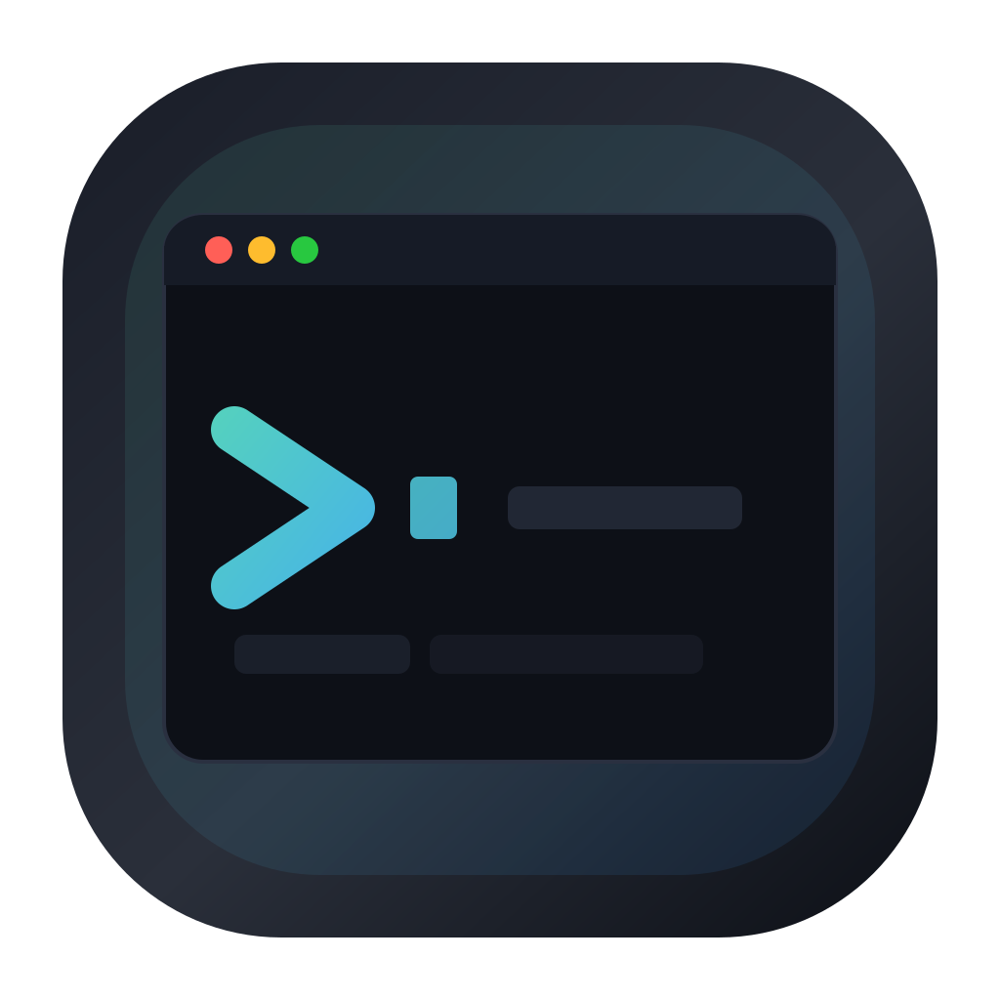

# Happy Flutter

A Flutter reimplementation of the Happy mobile app, achieving full feature parity with the original React Native implementation.

<p>
  
</p>

## Overview

Happy Flutter is a cross-platform mobile application built with Flutter that provides secure, end-to-end encrypted messaging, session management, and AI-assisted development workflows. This project maintains complete compatibility with the React Native implementation while leveraging Flutter's performance and native capabilities.

The app guides first-time setup from computer linking through session launch,
keeps navigation state alive between tabs, and surfaces each session's files,
workflow runs, and scheduled loops from the chat workspace menu. Empty chats
offer editable task starters plus file, slash-command, and voice hints; active
Codex turns distinguish updates to the running turn from queued follow-ups.
Web search details show aligned result cards with titles, domains, and snippets;
tap a result to open its web page in your browser.

Codex usage shows the account’s reported windows (including weekly and 5-hour
labels), additional pools when provided, and per-model availability. Usage
permission and purchased credit availability are shown separately.

## Architecture

The project follows **Feature-Based Clean Architecture** with clear separation of concerns:

```
lib/
├── main.dart                    # App entry, theme, AuthGate wiring
├── core/
│   ├── api/                     # ApiClient (Dio+NativeAdapter), SocketIoClient, per-domain API classes
│   ├── encryption/              # NaCl/libsodium (legacy) + AES-256-GCM (new), key derivation/caching
│   ├── i18n/                    # Localization helpers
│   ├── models/                  # Pure Dart models with manual fromJson/toJson/copyWith
│   ├── providers/               # Riverpod NotifierProviders (one file per notifier; app_providers.dart is the barrel)
│   ├── repositories/            # Injectable domain boundaries for providers and actions
│   ├── routing/                 # GoRouter setup (createRouter()) and 57 route definitions
│   ├── rpc/                     # RPC layer
│   ├── services/                # Auth, Sync (split across 21 part files), storage, push, TTS, etc.
│   ├── theme/                   # app_tokens.dart: AppSpacing, AppRadius, AppFontSize, AppDuration, AppBreakpoint
│   ├── ui/                      # Lower-level shared widgets (avatars, tab_bar, shimmer, diff, status_bar)
│   ├── components/              # Higher-level shared components (AppCard, AppEmptyState, sidebar, settings sections)
│   ├── widgets/                 # App-level widgets (ErrorBoundary, AuthGate, etc.)
│   └── utils/                   # InvalidateSync, SyncSubscriptionMixin, logging, helpers
└── features/
    ├── auth/                    # Landing, QR authentication, device linking, backup restore
    ├── changelog/               # In-app changelog viewer
    ├── chat/                    # Chat interface, input, markdown, tool views, autocomplete
    ├── command_palette/         # Modal command search
    ├── dev/                     # Dev logs, encryption debug, network inspector, notification test
    ├── inbox/                   # Friends, friend search, inbox
    ├── loops/                   # Recurring-prompt loops
    ├── machine/                 # Machine detail
    ├── mcp/                     # Remote MCP server management
    ├── providers/               # AI backend providers and usage
    ├── sessions/                # Session list (embeds Inbox + Settings as inline tabs), creation, pickers
    ├── settings/                # App settings (theme, language, voice, profiles, usage, machines, etc.)
    ├── sftp/                    # SFTP feature with own models/providers/screens
    ├── terminal/                # Terminal connect and screen
    ├── workflows/               # Workflow-run detail
    └── zen/                     # Todo/zen mode
```

Search temporarily shows individual tool calls so matching commands and
files can be revealed, then restores the previous tool visibility preference.
On desktop, Ctrl/Cmd+F opens and focuses conversation search. Enter and
Shift+Enter navigate search results; Escape closes the focused search field.

### Key Architectural Patterns

Desktop chats group completed tool calls by default, with a per-chat control
to show the full trace. Mobile keeps its existing hide-tools preference. Tool
summaries name successful file work and commands while retaining failures,
queued calls, cancellations, and approvals. The activity bar shows the recorded
running tool family and elapsed request time; its clock pauses with TickerMode.
An idle turn offers a result review sheet with the latest answer, recorded
changed files/diffs, and command output. These are bounded, cached display
projections of resident messages; command completion never implies tests passed.
Active Codex turns have separate, visible Update current turn and Queue for
next turn actions. Mobile keeps model/permission controls in the composer and
moves profile/context settings into Composer options. Session triage labels
separate unread assistant results from unread activity while still working.
The session pane can be hidden without losing its selection or scroll state;
dragging its divider resizes it. Chat inspectors allocate space only when
opened and use the available chat-pane width. The conversation and composer
share an 880px maximum reading width on desktop. Opening and closing an
inspector keeps the conversation mounted, preserving composer focus, draft
text, scroll position, and expanded tool rows.

- **State Management**: Riverpod v3 with manual `NotifierProvider` (no code generation)
- **Sync Singleton**: Central in-memory data hub (`Sync` class) — main file ~1,700 lines, split across 21 `part` files. `InvalidateSync` provides debounced server fetches with exponential backoff.
- **Provider Bridge**: Notifiers expose `loadFromSync()` (in-memory read) and `refreshFromSync()` (server fetch + read). Screens use `SyncSubscriptionMixin` (in `lib/core/utils/`) which wraps `sync.onDataChanged` / `onDomainChanged` with deduplication.
- **Network diagnostics**: Developer → Network Inspector retains the last 500 HTTP attempts on all native builds, with transport cause, retry, cache, lifecycle, and adapter timings. Power Diagnostics separates pause cancellations from failures and shows safe message page cursors to distinguish pagination from repeated fetches. The device link indicator does not prove DNS or server reachability. Chat opening bounds automatic older-history fetches to one page; quick settings edits share a bounded server-write window to reduce radio wakeups. Network handoffs renew the HTTP pool without cancelling concurrent writes. Older-history body timeouts retry smaller pages at the same boundary; usage RPCs coalesce and reserve Bash fallback for unsupported methods.
- **Repository Boundaries**: Session, machine, settings, artifact, message, and workflow operations are exposed through Riverpod-injectable repositories while `Sync` remains the compatibility facade.
- **Service/API Duality**: Some domains expose both a singleton `XxxService` (production) and an injectable `XxxApi` class (tests).
- **Platform-Specific Code**: Conditional exports — `platform_io.dart`/`platform_stub.dart`, `mmkv_storage_native.dart`/`mmkv_storage_web.dart`, `sodium_loader_native.dart`/`sodium_loader_web.dart`, `sentry_*.dart`

Background suspension cancels optional HTTP reads while retaining cached
catalogs for resume. Telemetry distinguishes these cancellations from real
failures and measures response bytes at the transport boundary instead of
guessing from decoded JSON collection sizes.

Message merges deduplicate complete incoming batches and preserve timeline
order. Outbox retries remain paused in the background, and retired runtimes
cannot restore their old queue into the current session. Unsent drafts are
saved when leaving chat; pending settings changes are flushed on suspension.

## Technology Stack

- **Flutter**: 3.41.x via mise (Dart 3.11+)
- **State Management**: Riverpod v3
- **Native hot paths**: Rust handles AES encryption/decryption, JSON validation,
  sidechain planning, and on-demand large terminal copy stripping; Dart remains
  the fallback if unavailable. WASM stage timers use the browser performance
  clock; CI checks sidechain planning and an AES-GCM roundtrip in release WASM.
- **HTTP Client**: Dio with NativeAdapter (Cronet/cupertino_http)
- **WebSocket**: Socket.IO protocol implementation
- **Encryption**: libsodium via `sodium` package + AES-256-GCM via `cryptography` package
- **Storage**: MMKV (flutter_mmkv) for fast local storage
- **Navigation**: GoRouter
- **UI**: Material Design 3 with custom design tokens

## Codex provider profiles

Codex profiles can define one or more OpenAI-compatible providers from the
profile editor. Add the provider ID, base URL, wire API, and the environment
variable name that contains its key; add that key as a profile environment
variable and select the default provider. The app forwards these definitions
to the machine that starts the Codex session, so provider credentials remain
environment variables rather than being written into Codex command-line
arguments.

Editing or duplicating a profile preserves its structured provider settings
and session defaults. API keys load lazily from secure storage, with hydration
and settings writes ordered to preserve concurrent edits.

The Codex model picker reloads the machine catalog when opened and offers
**Refresh models** without closing the sheet. Catalogs are scoped to the
machine, selected profile, and project directory, with a five-minute cache.
Hidden/internal models are excluded. Explicit profile model lists remain
authoritative; refresh failures retain existing choices and show a notice.
The machine's Codex installation still controls the upstream catalog and
its own refresh policy.

## Setup Instructions

### Prerequisites

1. Install mise: <https://mise.jdx.dev/getting-started.html>
2. Install the pinned toolchain: `mise install`

### Development Environment

```bash
# Install the pinned Flutter / Dart / Java / Make toolchain
mise install

# Get dependencies
mise exec -- flutter pub get

# Run code generation (for mocks)
mise exec -- flutter pub run build_runner build

# Run the app
mise exec -- flutter run

# Run tests
mise exec -- flutter test

# Analyze code
mise exec -- flutter analyze
```

### Build Flavors

- `development` — development server, debug logging enabled
- `preview` — staging server, reduced logging
- `production` — production server at `api.cluster-fluster.com`

```bash
# Build APK for development
mise exec -- flutter build apk --debug --flavor development

# Build APK for production
mise exec -- flutter build apk --release --flavor production

# Build for iOS
mise exec -- flutter build ios --release
```

### Install the Linux release

Download and extract the `happy-flutter-linux-x64.tar.gz` asset for Intel/AMD
Linux, or `happy-flutter-linux-arm64.tar.gz` for ARM64 Linux, from a GitHub
Release. Then run the included installer:

```bash
ARCH=x64 # use arm64 on ARM64 Linux
tar -xzf "happy-flutter-linux-${ARCH}.tar.gz"
./install-linux.sh
```

This installs the app under `~/.local/share/happy_flutter`, provides
`~/.local/bin/happy_flutter`, and adds it to desktop launchers.

Unfocused desktop windows pause animations and defer session-list refreshes
while keeping live message syncing connected. Refocusing catches up without
restarting the connection; minimizing or backgrounding still uses the normal
suspend/resume lifecycle.

Linux archives target glibc-based distributions. Alpine and other musl-based
systems are not supported by the Flutter Linux runtime in these bundles.

#### Auto-updates

Local installs keep themselves current, both while the app is running and in
the background:

- **In-app updater** (`lib/core/services/desktop_updater_service.dart`) —
  checks GitHub Releases ~20s after launch and every 6h. Newer builds are
  downloaded automatically; a slim banner on the sessions/chat screens offers
  a one-tap "Restart now" once the swap is staged. Extraction and cleanup run
  in background isolates and stream through disk so an update does not freeze
  the desktop UI or retain the inflated bundle in the app heap.
- **Background timer** — `install-linux.sh` arms a systemd user timer
  (`happy-flutter-updater.timer`, every 12h) that runs the bundled
  `update-linux.sh`. Pass `--no-autoupdate` to skip it. Both updaters share
  an flock so they never race.

Updates are applied via an atomic directory swap: the install path never
changes, so launchers, the `~/.local/bin/happy_flutter` symlink, and any
running process stay valid mid-update. Installed version metadata lives in
`manifest.json` inside the bundle (stamped by CI at archive time).
The previous bundle stays on disk while a running app may still need its
shaders or fonts. Later update checks remove retired bundles only when process
inspection confirms they are unused; restricted `/proc` access can postpone
cleanup. Recovery backups from failed swaps are preserved.

Other installer flags:

```bash
./install-linux.sh --uninstall    # remove app, units and desktop entry
HAPPY_UPDATE_REPO=you/happy_fork update-linux.sh   # custom release feed
update-linux.sh --check           # exit 10 when an update is available
```

## Project Structure

### Design Tokens

Spacing and radius tokens are defined in `lib/core/theme/app_tokens.dart`:

- **Spacing**: `AppSpacing.xs/sm/md/lg/xl/xxl/xxxl` (4/8/12/16/20/24/32 px)
- **Radius**: `AppRadius.xs/sm/md/lg/xl/pill` (4/8/12/16/20/100 px)

### Key Services

| Service | Pattern | Purpose |
|---------|---------|---------|
| `ApiClient` | Singleton | Dio + NativeAdapter. `validateStatus: (_) => true` — callers must check status manually |
| `SocketIoClient` | Singleton | Socket.IO on path `/v1/updates`, transport `['websocket']` only |
| `AuthService` | Singleton | QR authentication, Ed25519 signatures |
| `Sync` | Singleton | Central in-memory data hub with all server state |
| `Storage` | Singleton | MMKV wrapper for user data (cleared on logout) |

### State Management

Providers live in `lib/core/providers/`, one notifier per file. `app_providers.dart` is a barrel that re-exports them:

| Provider | State |
|----------|-------|
| `authStateNotifierProvider` | `AuthState` |
| `sessionsNotifierProvider` | `Map<String, Session>` |
| `machinesNotifierProvider` | `Map<String, Machine>` |
| `settingsNotifierProvider` | `Settings` |
| `connectionNotifierProvider` | `ConnectionStatus` |
| `currentSessionNotifierProvider` | `Session?` |
| `profileNotifierProvider` | `Profile?` |
| `sessionGitStatusNotifierProvider` | `Map<String, GitStatus>` |
| `artifactsNotifierProvider` | `Map<String, DecryptedArtifact>` |
| `friendsNotifierProvider` | `FriendsState` |
| `feedNotifierProvider` | `FeedState` |
| `todoStateNotifierProvider` | `TodoListState` |
| `chatActionNotifierProvider` | `void` (pure action dispatcher) |
| `syncStateNotifierProvider` | `SyncState` |
| `networkNotifierProvider` | `NetworkState` |
| `offlineDictationNotifierProvider` | `OfflineDictationState` |
| `loggerNotifierProvider` / `loggerServiceProvider` | logger debounced state / service |

Session ToDos are persisted in encrypted session metadata. Completed items stay
visible until a new item is added. Items can have a `parentId` and an
`agentId`; the chat task banner shows the hierarchy and assignee, and Tasks
can be filtered by agent.

## Security

- **End-to-end encryption**: NaCl/libsodium for session/machine data, AES-256-GCM for artifacts
- **Authentication**: Ed25519 signatures for device linking
- **Credentials**: Stored in `flutter_secure_storage`
- **App data**: Stored in MMKV (separate instance for server config that persists across logouts)
- **Certificate pinning**: Currently relies on platform CA store via NativeAdapter

**Web platform**: Web is supported — CI runs `flutter build web --release` and deploys it. Web-specific shims are used for storage (`mmkv_storage_web.dart` falls back to `SharedPreferences`) and crypto (`sodium_loader_web.dart`).

## Testing

- **Unit tests**: Comprehensive test suites for providers, APIs, and services
- **Widget tests**: Key UI components tested
- **Integration / e2e**: ~18 e2e files in `test/integration/` covering session spawning, message dedup, pagination, cold starts, reconnection, concurrent sends. Backed by `mock_sync_server.dart` and `fake_session_encryption.dart`, plus replay fixtures in `test/integration/jsonl_replay/`.
- **Mock generation**: Mockito for `ApiClient` mocking; `.mocks.dart` files sit next to each test
- **Test command**: `mise exec -- flutter test`

### Test Structure

```
test/
├── api/                    # API client tests
├── core/                   # Core utility tests
├── encryption/             # Encryption round-trip tests
├── features/               # Feature widget tests
├── providers/              # State management tests
├── services/               # Service tests
├── integration/            # End-to-end tests + mock_sync_server + jsonl_replay
└── helpers/                # createTestSync(), mockResponse<T>(), shared helpers
```

## Contribution Guidelines

### Coding Standards

- **Strict typing**: `implicit-casts: false`, `implicit-dynamic: false`
- **Line length**: 80 characters max
- **Prefer**: const constructors, final fields, single quotes, spread collections
- **Avoid**: `print` statements — use `logger.info/warning/error()`; `unawaited()` for intentional fire-and-forget

### Git Workflow

1. Create a feature branch from `main`
2. Make changes following the architecture patterns
3. Run tests: `mise exec -- flutter test`
4. Run analysis: `mise exec -- flutter analyze`
5. Commit with clear messages
6. Push and create PR

### Code Style

- Use `ConsumerStatefulWidget` + `ConsumerState` when the screen needs local state and Riverpod
- Use `ConsumerWidget` for stateless screens that only read providers
- Always guard on `sync.isInitialized` before calling `loadFromSync()`
- Hide Flutter's built-in `TabBar` when importing the custom one: `import 'package:flutter/material.dart' hide TabBar;`

## Documentation

- **Agent and workflow guidelines**: `AGENTS.md`, `CLAUDE.md` (mandatory guidance for code+docs updates)
- **Docs index**: `docs/AGENTS.md` (pointer to canonical docs and book chapters)
- **Feature Parity**: See `ROADMAP.md` for detailed tracking against React Native implementation
- **Architecture**: See `docs/ARCHITECTURE.md` for system design and data flow diagrams
- **Protocol**: See `docs/PROTOCOL.md` for authentication and encryption protocols

## References

- **Source of Truth**: `../happy` (React Native implementation)
- **Flutter Version**: 3.41.x via mise (Dart 3.11+)
- **CI/CD**: GitHub Actions with build flavors

## License

[Add your license information here]
